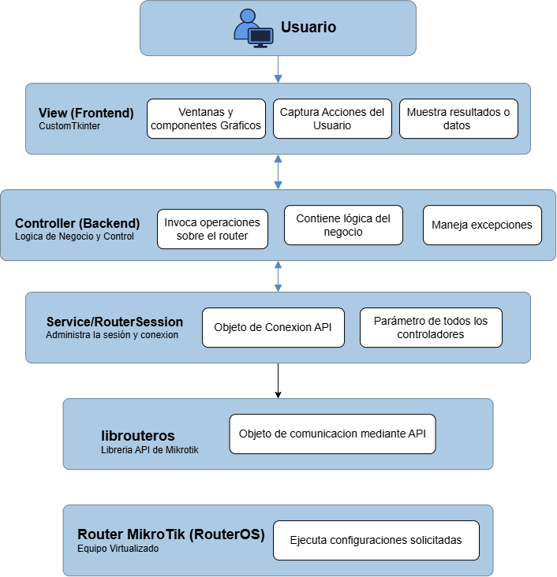

# Administración de Router MikroTik

Aplicación de escritorio en Python para administrar routers MikroTik mediante su API, con monitoreo de red en tiempo real.

## Tabla de contenido

- [Datos del estudiante](#datos-del-estudiante)
- [Descripción del proyecto](#descripción-del-proyecto)
- [Arquitectura del proyecto](#arquitectura-del-proyecto)
- [Funcionalidades implementadas](#funcionalidades-implementadas)
- [Tecnologías utilizadas](#tecnologías-utilizadas)
- [Requisitos](#requisitos)
- [Instalación y ejecución](#instalación-y-ejecución)

## Datos del estudiante

| | |
|---|---|
| **Nombre** | Andrea Fernanda Morel Alemán |
| **Número de cuenta** | 20221000591 |
| **Asignatura** | Tópicos especiales y avanzados |
| **Sección** | 1400 |
| **Docente** | Norman Cubilla |
| **Fecha de entrega** | Martes 2 de julio del 2026 |

## Descripción del proyecto

El proyecto es una aplicación de escritorio desarrollada en Python para la administración de routers MikroTik mediante su API. Permite gestionar la configuración del router, incluyendo direcciones IP, servidores DHCP, DNS, rutas estáticas y respaldos, además de ofrecer monitoreo en tiempo real del estado y tráfico de las interfaces de red.

La aplicación utiliza una arquitectura MVC, una interfaz desarrollada con CustomTkinter y la biblioteca `librouteros` para interactuar con RouterOS de MikroTik.

## Arquitectura del proyecto


## Funcionalidades implementadas

| Módulo | Descripción |
|---|---|
| Gestión del router | Permite asignar el nombre (Identity) del router MikroTik. |
| Direcciones IP | Permite crear y eliminar direcciones IP configuradas en el router. |
| Servidores DHCP | Permite crear y eliminar servidores DHCP para la asignación dinámica de direcciones IP. |
| Configuración DNS | Permite configurar los servidores DNS del router y eliminar su configuración cuando sea necesario. |
| Rutas estáticas | Permite crear y eliminar rutas estáticas para la administración del enrutamiento. |
| Monitoreo de interfaces | Muestra en tiempo real el estado (Up/Down), el tráfico de entrada (RX) y el tráfico de salida (TX) de dos interfaces de red del router. |
| Gestión de respaldos | Permite crear respaldos de la configuración del router y listar todos los respaldos disponibles almacenados en el dispositivo. |

## Tecnologías utilizadas

- **Python 3.14+**
- **CustomTkinter** — interfaz gráfica de escritorio
- **librouteros** — comunicación con la API de RouterOS
- Arquitectura **MVC** (Modelo - Vista - Controlador)

## Requisitos

Antes de ejecutar la aplicación, asegúrese de contar con los siguientes requisitos:

### Software
- Python 3.14 o superior instalado ([descargar aquí](https://www.python.org/downloads/))
- Git instalado para clonar el repositorio ([descargar aquí](https://git-scm.com/install/))
- Un editor de código recomendado para modificar o revisar el proyecto (por ejemplo, Visual Studio Code, PyCharm u otro IDE compatible con Python)

### Entorno MikroTik
- Un router MikroTik físico o una instancia virtualizada de RouterOS
- El dispositivo MikroTik debe tener habilitado el servicio API para permitir la comunicación con la aplicación
- El equipo donde se ejecuta la aplicación y el router MikroTik deben encontrarse en la misma red o tener conectividad entre ellos
- En caso de utilizar una máquina virtual, esta debe configurarse con un adaptador de red en modo Bridge o una configuración equivalente que permita la comunicación directa con la red del router

### Sistema operativo
- Compatible con cualquier sistema operativo que soporte Python

## Instalación y ejecución

Siga los siguientes pasos para instalar y ejecutar la aplicación:

### 1. Clonar el repositorio

Descargue el código fuente del proyecto utilizando Git:

```bash
git clone https://github.com/ndrtte/Mikrotik---Andrea-Morel.git
```

Ingrese al directorio del proyecto:

```bash
cd Mikrotik---Andrea-Morel
```

### 2. Crear entorno virtual

Se recomienda utilizar un entorno virtual para aislar las dependencias del proyecto:

```bash
python -m venv venv
```

Active el entorno virtual:

**Windows:**
```bash
venv\Scripts\activate
```

**Linux/macOS:**
```bash
source venv/bin/activate
```

### 3. Instalar dependencias

Instale las librerías necesarias utilizando el archivo `requirements.txt`:

```bash
pip install -r requirements.txt
```

### 4. Ejecutar la aplicación

Con el entorno virtual activado, ejecute la aplicación mediante:

```bash
python -B app.py
```

> **Nota:** el parámetro `-B` evita la generación de archivos de caché `__pycache__` durante la ejecución.

## Documentacion externa
- [Custom Tkinter](https://customtkinter.tomschimansky.com/documentation/)
- [librouteros](https://librouteros.readthedocs.io/en/4.1.1/)
